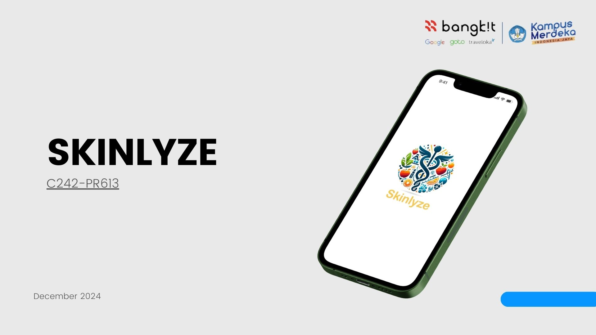

# SKINLYZE - Capstone Project C242-PR613

## Overview
This project aims to solve the problem that yany people tend to ignore early signs of skin conditions such as moles, rashes, spots, or lesions because of lack of awareness or reluctance to seek medical advice by developing an android application that can give information about skin disease by capturing a picture of skin conditions, then giving the name of the skin disease and treatment that can be done to the user, making skin disease diagnosis easier and more accessible.

## Table of Contents
- [Project Overview](#overview)
- [Project Scope](#project-scope)
- [Technology Stack](#technology-stack)
- [Dataset](#dataset)
- [Main Repository](#main-repository)
- [Team Members](#team-members)

## Project Scope
- ML model can classify skin image into one of 7 diseases.
- Android app can take a picture using camera
- Android app can give information about the disease and treatment recomendation using data taken from database

## Technology Stack

### Machine Learning
 - Tensorflow - Framework
 - Google Colab - Development Environment
 - Python - Programming Language

### Cloud Computing
 - Javascript - Programming Language
 - Node js - Runtime Environment
 - Express js - Framework
 - Google Cloud Platform - Cloud Provider

### Mobile Development
 - Kotlin - Programming Language
 - Figma - Design Tool

## Dataset
We use datasets sourced from [Harvard Dataverse (The HAM10000 dataset) and ISIC](https://dataverse.harvard.edu/dataset.xhtml?persistentId=doi:10.7910/DVN/DBW86T), which provide extensive collections of images for skin lesion analysis and classification.

## Main Repository
- Machine Learning - <https://github.com/Skinlyze/Skinlyze-ML.git>
- Backend API - <https://github.com/Skinlyze/Skinlyze-Backend.git>
- Frontent Android - <https://github.com/Skinlyze/Skinlyze-Frontend-Android.git>

## Team Members

| ID           | Name                            | Institution                          | Role                                | Status  | Github Profile                                         
|--------------|---------------------------------|--------------------------------------|-------------------------------------|---------|--------------------------------------------------
| M001B4KY0821 | Bayu Nurbiantoro                | Institut Pertanian Bogor             | Machine Learning                    | Active  | [@BayuN-27](https://github.com/BayuN-27)         
| M312B4KY3589 | Rafid Ahmad Arfianto            | Universitas Sebelas Maret            | Machine Learning                    | Active  | [@rafid0004](https://github.com/rafid0004)       
| C120B4KX0711 | Atika Aji Hadiyani              | Institut Teknologi Telkom Purwokerto | Cloud Computing                     | Active  | [@atikaaji09](https://github.com/atikaaji09)     
| C247B4KY2846 | Muhammad Fauzan Naufal Ridho    | Universitas Lambung Mangkurat        | Cloud Computing                     | Active  | [@ozannaufal15](https://github.com/ozannaufal15) 
| C504B4KY3114 | Muhammad Yansah                 | Institut Sains dan Bisnis Atma Luhur | Cloud Computing                     | Active  | [@norGunnar](https://github.com/norGunnar)       
| A299B4KY3563 | Raden Rahman Ismail             | Universitas Pendidikan Indonesia     | Mobile Development                  | Active  | [@SuraGendil](https://github.com/SuraGendil)     

## Contact
For more information, please contact:
 - Muhammad Fauzan Naufal Ridho - <c247b4ky2846@bangkit.academy>
